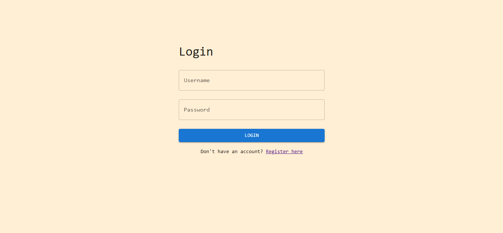
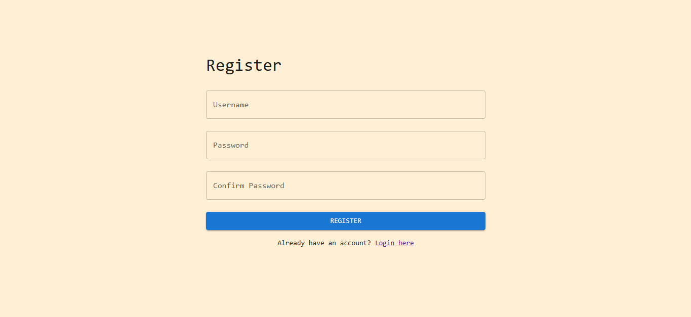
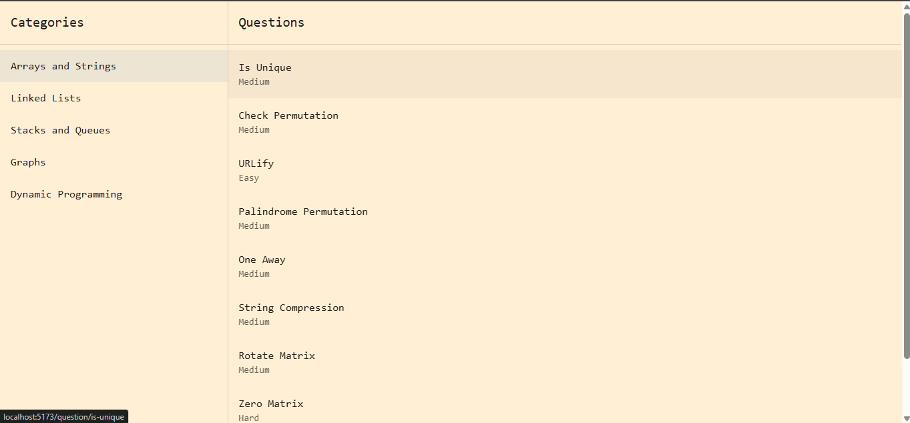
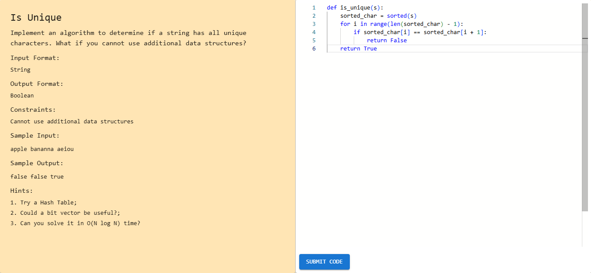
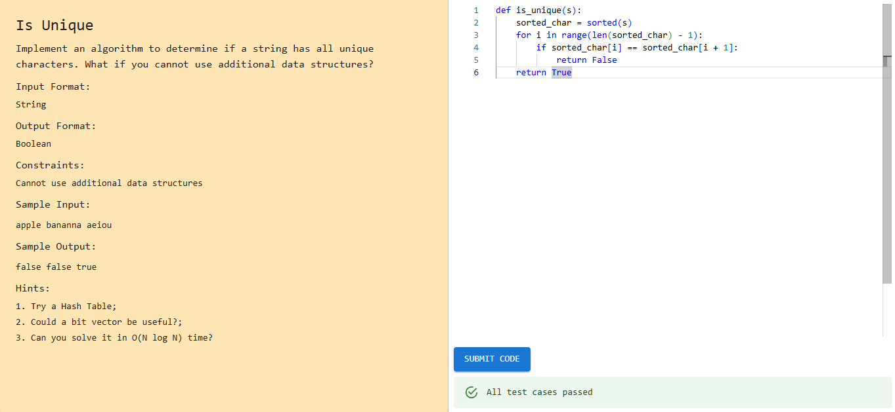

# DSA

### Django+React

## Description

A Data Structurs and Algorithms Problem solving app.

## Specification

1. Authentication

- 

- 

  2.Questions Page: Display the coding problem according to the datastructure.

- 

  3.Solve: Solve the coding problem.

- 
- 

# How to run

1.  Load the Questions.csv by going to the dsa_analysis: python manage.py import_questions questions.csv

2.  Start the django server by going to the dsa_analysis directory: python manage.py runserver.

3.  Runt the front end by npm run dev in the dsa_frontend directory

4.  Start the redis server (wsl recommended): redis-sever

5.  Start the celery server in the dsa_analysis directory: celery -A dsa_analysis worker --pool=solo -l info

to install necessary dependencies run pip install -r requirements.txt
Note: redis should be installed in local pc for this application to work.
